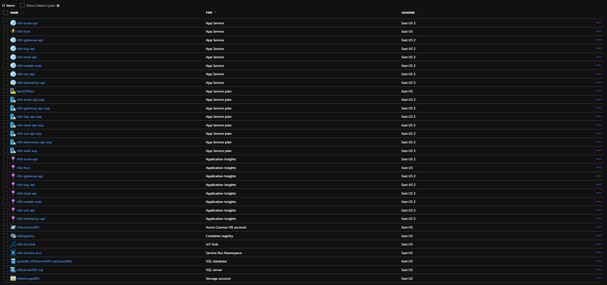

# Infrastructure RFID Tag Reading

Infrastructure RFID Tag Reading, implemented after Master's Work.

## Project architecture

This repository provides the implementation of infrastructure of the projects [rfid-reader-middleware](https://github.com/yagoluiz/rfid-reader-middleware), [rfid-reader-api](https://github.com/yagoluiz/rfid-reader-api) and [rfid-reader-web](https://github.com/yagoluiz/rfid-reader-web).



## Project structure

The infrastructure was organized through [modules](https://www.terraform.io/docs/configuration/modules.html). Where each module represents a context within the infrastructure.

```
├── src
    ├── modules (resources)
        ├── container
        ├── databases
        ├── functions
        ...
    ├── main.tf (execute modules)
    ├── outputs.tf (connections)
    ├── provider.tf (Azure)
```

## Master's work

See the work [repository](https://github.com/yagoluiz/unb-dissertacao) for more details of the project.

## Technologies

- Terraform (Azure Provider)

## Instructions for run project

1. Install [Terraform](https://www.terraform.io/downloads.html)

2. Install [Azure CLI](https://docs.microsoft.com/en-us/cli/azure/install-azure-cli)

3. Azure account login

> *az login*

4. In path **src** in project root, execute commands Terraform

> *terraform init* **(install modules and provider)**

> *terraform validate* **(validate scripts)**

> *terraform apply* **(apply infrastructure)**

> *terraform destroy* **(remove infrastructure)**

# [PT-BR] Infraestrutura de Leitura de Tags RFID

Infraestrutura de Leitura de Tags RFID, implementado após trabalho de Mestrado.

## Arquitetura do projeto

Este repositório apresenta a implementação de toda infraestrutura dos projetos [rfid-reader-middleware](https://github.com/yagoluiz/rfid-reader-middleware), [rfid-reader-api](https://github.com/yagoluiz/rfid-reader-api) e [rfid-reader-web](https://github.com/yagoluiz/rfid-reader-web).

## Estrutura do projeto

A infraestrutura foi organizada através de [módulos](https://www.terraform.io/docs/configuration/modules.html). Onde cada módulo representa um contexto dentro da infraestrutura.

```
├── src
    ├── modules (recursos)
        ├── container
        ├── databases
        ├── functions
        ...
    ├── main.tf (executar módulos)
    ├── outputs.tf (conexões)
    ├── provider.tf (Azure)
```

## Trabalho de Mestrado

Consulte o [repositório](https://github.com/yagoluiz/unb-dissertacao) do trabalho para mais detalhes do projeto.

## Tecnologias

- Terraform (Azure Provider)

## Instruções para execução do projeto

1. Instalar [Terraform](https://www.terraform.io/downloads.html)

2. Instalar [Azure CLI](https://docs.microsoft.com/en-us/cli/azure/install-azure-cli)

3. Logar em uma conta Azure

> *az login*

4. Na pasta **src** na raíz do projeto, executar os comandos Terraform

> *terraform init* **(iniciar modulos e provider)**

> *terraform validate* **(validar scripts)**

> *terraform apply* **(aplicar infraestrutura)**

> *terraform destroy* **(remover infraestrutura)**